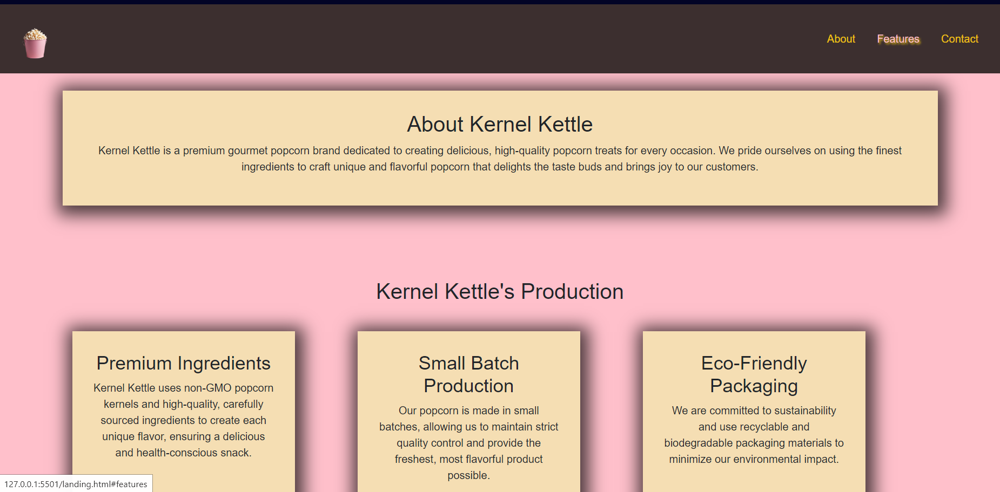

# ProductLanding

## Table of Contents
- [Introduction](#introduction)
- [Features](#features)
- [Screenshots](#screenshots)

## Introduction
Kernel Kettle is a gourmet popcorn brand committed to crafting delicious, high-quality popcorn using the finest ingredients. Our landing page highlights our unique flavors, eco-friendly practices, and small-batch production methods

## Features
- Responsive Design: Ensures optimal viewing across all devices, from desktops to smartphones.

- About Section: Provides an overview of Kernel Kettle's brand and mission.

- Features Section: Details our production process, including the use of premium ingredients, small-batch production, and eco-friendly packaging.

- Product Listings: Showcases our various popcorn flavors with descriptions, images, and pricing.

- Video Section: Engages visitors with a featured video showcasing our production process.

- Contact Form: Allows users to get in touch with us for inquiries or feedback.

## Screenshots

Landing Page: Simple introduction to the platform with card-style boxes that list the features of the products.

